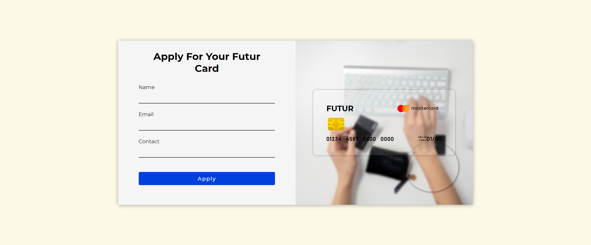

# Glassmorphic Credit Card
This project is based on Glassmorphism which is a new design trend that is currently very popular. The main aspect of this trend is a semi-transparent background, with a sublime shadow and border.

## Things I try to come up with:

- Adding hover states for all interactive elements on the page.
- Coming up with suitable stylings for fonts and box-model.
- Writing clean code as much as possiblle.
- Following best HTML practices in order to keep the HTML documents consistent and organized.

## Table of contents

- [Overview](#overview)
  - [The challenge](#the-challenge)
  - [Screenshot](#screenshot)
  - [Links](#links)
- [My process](#my-process)
  - [Built with](#built-with)
  - [What I learned](#what-i-learned)
  - [Continued development](#continued-development)
- [Author](#author)
- [Acknowledgments](#acknowledgments)

## Overview

### The challenge

Users should be able to:

- View the optimal layout for the site depending on their device's screen size
- See hover states for all interactive elements on the page

### Screenshot

### Links

- Live Site URL: [https://glassmorphic-credit-card.vercel.app/](https://glassmorphic-credit-card.vercel.app/)

### Built with

- Semantic HTML5 markup
- CSS custom properties
- Flexbox
- CSS Grid

### What I learned

- Applying Glassmorphism effect usig HTML and CSS

### Continued development

- Looking to improve the use of best practices when using svgs in inline with elements.
- Coming up with suitable stylings for fonts and box-model.

## Author

- Website - [Chathura Perera](https://www.your-site.com)
